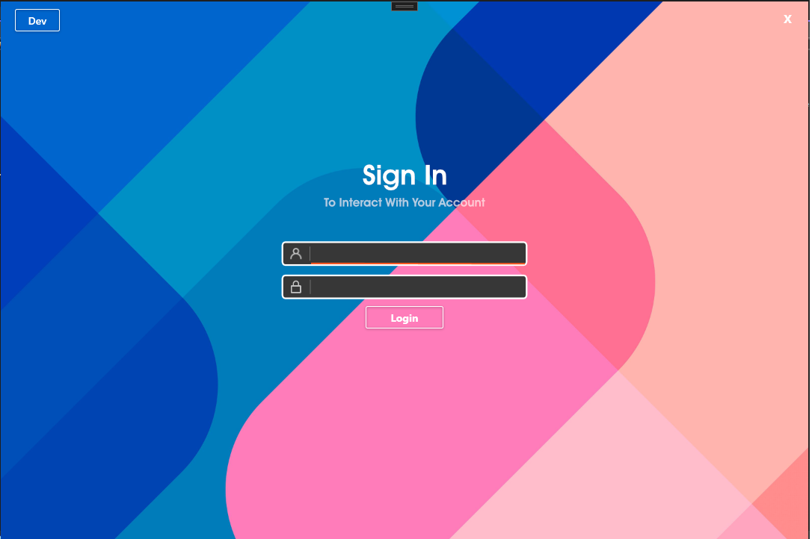

# PremierEPOS Influx Ticketing System

A customer ticketing system for logging customer calls, complaints and queries, and business statistics. Used daily by Premier EPOS staff.

## Installation

Project requires [.Net 5](https://dotnet.microsoft.com/download/dotnet/5.0) to install / edit.

## Photos & Screenshots [ Login, Dashboard, Ticket Viewer ]

## Contributing
Pull requests are welcome. For major changes, please open an issue first to discuss what you would like to change.
Please make sure to update tests as appropriate.

## License
[Free To Use](https://choosealicense.com/licenses/mit/)
